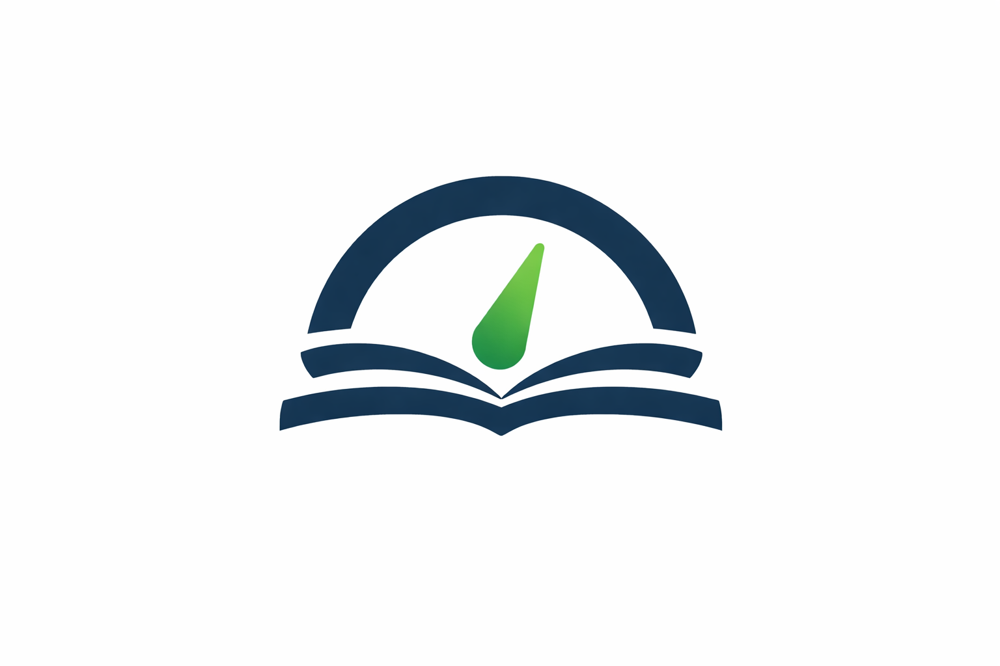

<p align="center">
  
</p>

# KnowGauge

KnowGauge is a RAG-based Spring Boot platform for generating intelligent knowledge assessments. Build a RAG-based Spring Boot application that generates multiple-choice tests (MCQs) from stored documents organized by topics and subtopics.

## Key Features

- 📚 **Document Management**: Upload and organize documents (PDFs) by hierarchical topics
- 🧠 **RAG-Powered Generation**: Generate MCQ tests using Retrieval-Augmented Generation
- 🎯 **Semantic Search**: pgvector-powered similarity search for relevant content retrieval
- 📊 **Comprehensive Domain Model**: Complete entity model covering documents, tests, attempts, and embeddings
- 🔄 **Reproducibility**: Full audit trail for generation runs and test attempts
- 🎨 **Landing Page**: Static web interface with logo and branding
- 📦 **Object Storage**: MinIO integration for document storage
- 🌳 **Hierarchical Topics**: Unlimited depth topic trees for knowledge organization

## Project Structure

This is a multi-module Maven project with the following structure:

```
knowgauge-service/
├── pom.xml (parent)
├── docker-compose.yml
├── Dockerfile
├── DOMAIN_MODEL.md                                     # Complete domain model documentation
├── knowgauge-service-core/                             # Core business logic and domain models
├── knowgauge-service-contract/                         # API contracts and DTOs
├── knowgauge-service-client/                           # Client library for consuming services
├── knowgauge-service-rest-api/                         # REST API layer (executable application)
│   └── src/main/resources/static/                      # Static web content (landing page, logo)
└── knowgauge-service-infra/                            # Infrastructure layer
    ├── knowgauge-service-jpa-repo/                     # JPA repositories and entities
    ├── knowgauge-service-llm/                          # LLM integration
    ├── knowgauge-service-minio-storage/                # MinIO object storage
    └── knowgauge-service-pg-vector/                    # PostgreSQL pgvector integration
```

## Modules

### knowgauge-service-core
Core business logic and domain models. This module is framework-independent and contains the heart of the application logic. Includes all domain entities (Topic, Document, DocumentSection, DocumentChunk, Test, TestQuestion, Attempt, etc.) and enums. Uses Lombok for boilerplate reduction.

### knowgauge-service-contract
API contracts and DTOs (Data Transfer Objects). Defines the interface contracts that other modules and external clients can depend on.

### knowgauge-service-client
Client library for consuming KnowGauge services. This module can be used by external applications to interact with the KnowGauge service.

### knowgauge-service-rest-api
REST API layer built with Spring Boot. This is the executable application that exposes the REST endpoints.
- Contains the main `@SpringBootApplication` class
- Depends on core, contract, and infra modules
- Includes Flyway database migrations
- Serves static web content (landing page with logo)

### knowgauge-service-infra
Infrastructure layer split into specialized modules for better separation of concerns:

#### knowgauge-service-jpa-repo
- JPA/Hibernate repositories for database access
- Entity mappings for all domain models
- PostgreSQL support

#### knowgauge-service-llm
- Integration with Large Language Models (LLMs)
- Question generation logic
- RAG (Retrieval-Augmented Generation) pipeline

#### knowgauge-service-minio-storage
- MinIO object storage integration
- Document upload and storage
- File management

#### knowgauge-service-pg-vector
- PostgreSQL pgvector extension integration
- Vector embeddings storage and retrieval
- Semantic similarity search

## Building the Project

### Prerequisites
- Java 17 or higher
- Maven 3.6 or higher

### Build Commands

Build all modules:
```bash
mvn clean install
```

Build without tests:
```bash
mvn clean install -DskipTests
```

Build and package the application:
```bash
mvn clean package
```

## Running the Application

### Using Docker Compose (Recommended)

The easiest way to run the application with all dependencies:

```bash
docker-compose up
```

This will start:
- PostgreSQL database with pgvector extension
- KnowGauge service

The application will be available at: http://localhost:8080

### Running Locally

1. Start a PostgreSQL database with pgvector extension:
```bash
docker run -d -p 5432:5432 \
  -e POSTGRES_DB=knowgauge \
  -e POSTGRES_USER=knowgauge_user \
  -e POSTGRES_PASSWORD=knowgauge_pass \
  pgvector/pgvector:pg15
```

2. Build the project:
```bash
mvn clean install -DskipTests
```

3. Run the application:
```bash
java -jar knowgauge-service-rest-api/target/knowgauge-service-rest-api-1.0.0-SNAPSHOT.jar
```

## Database Schema

The application uses PostgreSQL with pgvector extension and Flyway migrations. The database schema includes:

**Migration V1 (Initial Schema):**
- **topics**: Hierarchical topic structure (supports unlimited depth via parent_id)
- **documents**: Uploaded documents with metadata and status tracking
- **document_sections**: Optional document structure for better chunking
- **document_chunks**: Logical text chunks for grounding
- **tests**: Generated MCQ tests with reproducibility tracking
- **test_questions**: Individual questions with multiple-choice answers
- **attempts**: User test attempts and scoring
- **attempt_answers**: User answers to questions
- **generation_runs**: Audit trail for RAG generation runs

**Migration V2 (pgvector and Embeddings):**
- **chunk_embeddings**: Vector embeddings storage with pgvector
- IVFFlat index for similarity search (cosine distance)
- Indexes on topic_id, document_id for metadata filtering

See `DOMAIN_MODEL.md` for complete details on all entities, fields, and relationships.

## Development

### Module Dependencies

```
rest-api → core, contract, infra modules (jpa-repo, llm, minio-storage, pg-vector)
client → contract
infra/jpa-repo → core
infra/llm → core
infra/minio-storage → core
infra/pg-vector → core
core → (independent)
contract → (independent)
```

### Adding New Features

1. Add domain logic to `knowgauge-service-core`
2. Define API contracts in `knowgauge-service-contract`
3. Implement REST endpoints in `knowgauge-service-rest-api`
4. Add database entities and repositories in `knowgauge-service-infra/knowgauge-service-jpa-repo`
5. Implement external integrations in appropriate infra modules (llm, minio-storage, pg-vector)

## Technology Stack

- Java 17
- Spring Boot 3.2.1
- Spring Data JPA
- Flyway (database migrations)
- PostgreSQL with pgvector extension
- Lombok (boilerplate reduction)
- Maven
- Docker & Docker Compose
- MinIO (object storage)
- LLM integration (RAG-based question generation)

